Heart Attack Risk Assessment
================
Trevor Okinda
2024

- [Student Details](#student-details)
- [Setup Chunk](#setup-chunk)
  - [Source:](#source)
  - [Reference:](#reference)
- [Understanding the Dataset (Exploratory Data Analysis
  (EDA))](#understanding-the-dataset-exploratory-data-analysis-eda)
  - [Loading the Dataset](#loading-the-dataset)
  - [Measures of Frequency](#measures-of-frequency)
  - [Measures of Central Tendency](#measures-of-central-tendency)
  - [Measures of Distribution](#measures-of-distribution)
  - [Measures of Relationship](#measures-of-relationship)
  - [ANOVA](#anova)
  - [Plots](#plots)

# Student Details

|                       |                              |
|-----------------------|------------------------------|
| **Student ID Number** | 134780                       |
| **Student Name**      | Trevor Okinda                |
| **BBIT 4.2 Group**    | C                            |
| **Project Name**      | Heart Attack Risk Assessment |

# Setup Chunk

**Note:** the following KnitR options have been set as the global
defaults: <BR>
`knitr::opts_chunk$set(echo = TRUE, warning = FALSE, eval = TRUE, collapse = FALSE, tidy = TRUE)`.

More KnitR options are documented here
<https://bookdown.org/yihui/rmarkdown-cookbook/chunk-options.html> and
here <https://yihui.org/knitr/options/>.

### Source:

The dataset that was used can be downloaded here: *\<<a
href="https://www.kaggle.com/datasets/fajobgiua/heart-attack-risk-assessment-dataset/data\"
class="uri">https://www.kaggle.com/datasets/fajobgiua/heart-attack-risk-assessment-dataset/data\</a>\>*

### Reference:

*\<Job Giua Fa (2023). Heart Attack Risk Assessment Dataset. Kaggle. <a
href="https://www.kaggle.com/datasets/fajobgiua/heart-attack-risk-assessment-dataset\"
class="uri">https://www.kaggle.com/datasets/fajobgiua/heart-attack-risk-assessment-dataset\</a>\>  
Refer to the APA 7th edition manual for rules on how to cite datasets:
<https://apastyle.apa.org/style-grammar-guidelines/references/examples/data-set-references>*

# Understanding the Dataset (Exploratory Data Analysis (EDA))

## Loading the Dataset

``` r
# Load dataset using read.csv
HeartRiskData <- read.csv("Heart_Attack_Risk_Levels_Dataset.csv", colClasses = c(
  Age = "numeric",
  Gender = "factor",
  Heart_rate = "numeric",
  Systolic_blood_pressure = "numeric",
  Diastolic_blood_pressure = "numeric",
  Blood_sugar = "numeric",
  CK_MB = "numeric",
  Troponin = "numeric",
  Result = "factor",
  Risk_Level = "factor"
))

# Preview structure and first few rows
str(HeartRiskData)
```

    ## 'data.frame':    1319 obs. of  10 variables:
    ##  $ Age                     : num  63 20 56 66 54 52 38 61 49 65 ...
    ##  $ Gender                  : Factor w/ 2 levels "0","1": 2 2 2 2 2 1 1 2 1 2 ...
    ##  $ Heart_rate              : num  66 94 64 70 64 61 40 60 60 61 ...
    ##  $ Systolic_blood_pressure : num  160 98 160 120 112 112 179 214 154 160 ...
    ##  $ Diastolic_blood_pressure: num  83 46 77 55 65 58 68 82 81 95 ...
    ##  $ Blood_sugar             : num  160 296 270 270 300 87 102 87 135 100 ...
    ##  $ CK_MB                   : num  1.8 6.75 1.99 13.87 1.08 ...
    ##  $ Troponin                : num  0.012 1.06 0.003 0.122 0.003 0.004 0.003 2.37 0.004 0.011 ...
    ##  $ Result                  : Factor w/ 2 levels "negative","positive": 1 2 1 2 1 1 1 2 1 1 ...
    ##  $ Risk_Level              : Factor w/ 3 levels "High","Low","Moderate": 3 1 3 1 3 2 3 1 3 3 ...

``` r
head(HeartRiskData)
```

    ##   Age Gender Heart_rate Systolic_blood_pressure Diastolic_blood_pressure
    ## 1  63      1         66                     160                       83
    ## 2  20      1         94                      98                       46
    ## 3  56      1         64                     160                       77
    ## 4  66      1         70                     120                       55
    ## 5  54      1         64                     112                       65
    ## 6  52      0         61                     112                       58
    ##   Blood_sugar CK_MB Troponin   Result Risk_Level
    ## 1         160  1.80    0.012 negative   Moderate
    ## 2         296  6.75    1.060 positive       High
    ## 3         270  1.99    0.003 negative   Moderate
    ## 4         270 13.87    0.122 positive       High
    ## 5         300  1.08    0.003 negative   Moderate
    ## 6          87  1.83    0.004 negative        Low

``` r
View(HeartRiskData)
```

## Measures of Frequency

``` r
# Measures of Frequency
# Frequency count for categorical variables (e.g., Gender, Result, Risk_Level)
table(HeartRiskData$Gender)
```

    ## 
    ##   0   1 
    ## 449 870

``` r
table(HeartRiskData$Result)
```

    ## 
    ## negative positive 
    ##      509      810

``` r
table(HeartRiskData$Risk_Level)
```

    ## 
    ##     High      Low Moderate 
    ##      812      275      232

## Measures of Central Tendency

``` r
# Measures of Central Tendency
# Mean, Median for numeric variables
mean(HeartRiskData$Age, na.rm = TRUE)
```

    ## [1] 56.19333

``` r
median(HeartRiskData$Age, na.rm = TRUE)
```

    ## [1] 58

``` r
mean(HeartRiskData$Heart_rate, na.rm = TRUE)
```

    ## [1] 78.33662

``` r
median(HeartRiskData$Heart_rate, na.rm = TRUE)
```

    ## [1] 74

``` r
mean(HeartRiskData$Systolic_blood_pressure, na.rm = TRUE)
```

    ## [1] 127.1706

``` r
median(HeartRiskData$Systolic_blood_pressure, na.rm = TRUE)
```

    ## [1] 124

``` r
mean(HeartRiskData$Diastolic_blood_pressure, na.rm = TRUE)
```

    ## [1] 72.26914

``` r
median(HeartRiskData$Diastolic_blood_pressure, na.rm = TRUE)
```

    ## [1] 72

``` r
mean(HeartRiskData$Blood_sugar, na.rm = TRUE)
```

    ## [1] 146.6343

``` r
median(HeartRiskData$Blood_sugar, na.rm = TRUE)
```

    ## [1] 116

``` r
mean(HeartRiskData$CK_MB, na.rm = TRUE)
```

    ## [1] 15.27431

``` r
median(HeartRiskData$CK_MB, na.rm = TRUE)
```

    ## [1] 2.85

``` r
mean(HeartRiskData$Troponin, na.rm = TRUE)
```

    ## [1] 0.3609424

``` r
median(HeartRiskData$Troponin, na.rm = TRUE)
```

    ## [1] 0.014

## Measures of Distribution

``` r
# Measures of Distribution
# Standard Deviation and Range for numeric variables
sd(HeartRiskData$Age, na.rm = TRUE)
```

    ## [1] 13.63817

``` r
sd(HeartRiskData$Heart_rate, na.rm = TRUE)
```

    ## [1] 51.63027

``` r
sd(HeartRiskData$Systolic_blood_pressure, na.rm = TRUE)
```

    ## [1] 26.12272

``` r
sd(HeartRiskData$Diastolic_blood_pressure, na.rm = TRUE)
```

    ## [1] 14.03392

``` r
sd(HeartRiskData$Blood_sugar, na.rm = TRUE)
```

    ## [1] 74.92304

``` r
sd(HeartRiskData$CK_MB, na.rm = TRUE)
```

    ## [1] 46.32708

``` r
sd(HeartRiskData$Troponin, na.rm = TRUE)
```

    ## [1] 1.154568

``` r
# Range of variables
range(HeartRiskData$Age, na.rm = TRUE)
```

    ## [1]  14 103

``` r
range(HeartRiskData$Heart_rate, na.rm = TRUE)
```

    ## [1]   20 1111

``` r
range(HeartRiskData$Systolic_blood_pressure, na.rm = TRUE)
```

    ## [1]  42 223

``` r
range(HeartRiskData$Diastolic_blood_pressure, na.rm = TRUE)
```

    ## [1]  38 154

``` r
range(HeartRiskData$Blood_sugar, na.rm = TRUE)
```

    ## [1]  35 541

``` r
range(HeartRiskData$CK_MB, na.rm = TRUE)
```

    ## [1]   0.321 300.000

``` r
range(HeartRiskData$Troponin, na.rm = TRUE)
```

    ## [1]  0.001 10.300

## Measures of Relationship

``` r
# Measures of Relationship
# Correlation between numeric variables
cor(HeartRiskData$Age, HeartRiskData$Heart_rate, use = "complete.obs")
```

    ## [1] -0.02365455

``` r
cor(HeartRiskData$Systolic_blood_pressure, HeartRiskData$Diastolic_blood_pressure, use = "complete.obs")
```

    ## [1] 0.5861663

``` r
cor(HeartRiskData$Blood_sugar, HeartRiskData$CK_MB, use = "complete.obs")
```

    ## [1] 0.04575658

``` r
cor(HeartRiskData$Troponin, HeartRiskData$Heart_rate, use = "complete.obs")
```

    ## [1] 0.01117985

``` r
# Cross-tabulation for categorical variables
table(HeartRiskData$Result, HeartRiskData$Risk_Level)
```

    ##           
    ##            High Low Moderate
    ##   negative    2 275      232
    ##   positive  810   0        0

## ANOVA

``` r
# ANOVA: Test if Age differs significantly across Risk_Level groups
anova_age_risk <- aov(Age ~ Risk_Level, data = HeartRiskData)
summary(anova_age_risk)
```

    ##               Df Sum Sq Mean Sq F value Pr(>F)    
    ## Risk_Level     2  14053    7026   40.01 <2e-16 ***
    ## Residuals   1316 231095     176                   
    ## ---
    ## Signif. codes:  0 '***' 0.001 '**' 0.01 '*' 0.05 '.' 0.1 ' ' 1

``` r
# ANOVA: Test if Heart_rate differs significantly across Risk_Level groups
anova_heart_rate_risk <- aov(Heart_rate ~ Risk_Level, data = HeartRiskData)
summary(anova_heart_rate_risk)
```

    ##               Df  Sum Sq Mean Sq F value Pr(>F)
    ## Risk_Level     2    2224    1112   0.417  0.659
    ## Residuals   1316 3511149    2668

``` r
# ANOVA: Test if Systolic_blood_pressure differs significantly across Risk_Level groups
anova_systolic_risk <- aov(Systolic_blood_pressure ~ Risk_Level, data = HeartRiskData)
summary(anova_systolic_risk)
```

    ##               Df Sum Sq Mean Sq F value Pr(>F)    
    ## Risk_Level     2 124901   62451   106.1 <2e-16 ***
    ## Residuals   1316 774497     589                   
    ## ---
    ## Signif. codes:  0 '***' 0.001 '**' 0.01 '*' 0.05 '.' 0.1 ' ' 1

``` r
# ANOVA: Test if Blood_sugar differs significantly across Risk_Level groups
anova_blood_sugar_risk <- aov(Blood_sugar ~ Risk_Level, data = HeartRiskData)
summary(anova_blood_sugar_risk)
```

    ##               Df  Sum Sq Mean Sq F value Pr(>F)    
    ## Risk_Level     2  712926  356463   70.17 <2e-16 ***
    ## Residuals   1316 6685618    5080                   
    ## ---
    ## Signif. codes:  0 '***' 0.001 '**' 0.01 '*' 0.05 '.' 0.1 ' ' 1

``` r
# ANOVA: Test if CK_MB differs significantly across Risk_Level groups
anova_ck_mb_risk <- aov(CK_MB ~ Risk_Level, data = HeartRiskData)
summary(anova_ck_mb_risk)
```

    ##               Df  Sum Sq Mean Sq F value  Pr(>F)    
    ## Risk_Level     2  133077   66538   32.48 1.7e-14 ***
    ## Residuals   1316 2695613    2048                    
    ## ---
    ## Signif. codes:  0 '***' 0.001 '**' 0.01 '*' 0.05 '.' 0.1 ' ' 1

``` r
# ANOVA: Test if Troponin differs significantly across Risk_Level groups
anova_troponin_risk <- aov(Troponin ~ Risk_Level, data = HeartRiskData)
summary(anova_troponin_risk)
```

    ##               Df Sum Sq Mean Sq F value Pr(>F)    
    ## Risk_Level     2  103.4   51.72   41.17 <2e-16 ***
    ## Residuals   1316 1653.5    1.26                   
    ## ---
    ## Signif. codes:  0 '***' 0.001 '**' 0.01 '*' 0.05 '.' 0.1 ' ' 1

``` r
# Normality check
plot(anova_age_risk, 2)  # Q-Q plot for Age vs Risk_Level
```

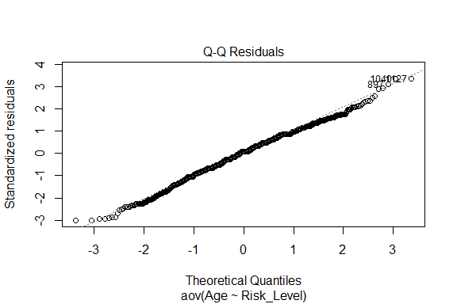<!-- -->

``` r
# Homogeneity of variance
bartlett.test(Age ~ Risk_Level, data = HeartRiskData)
```

    ## 
    ##  Bartlett test of homogeneity of variances
    ## 
    ## data:  Age by Risk_Level
    ## Bartlett's K-squared = 3.626, df = 2, p-value = 0.1632

## Plots

``` r
# Histogram for Age
hist(HeartRiskData$Age, 
     main = "Distribution of Age", 
     xlab = "Age", 
     col = "lightblue", 
     border = "black")
```

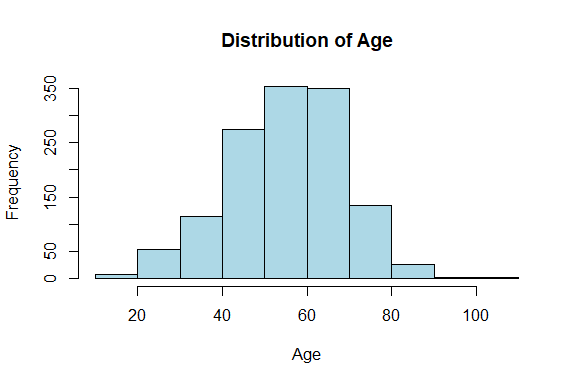<!-- -->

``` r
# Boxplot for Heart_rate
boxplot(HeartRiskData$Heart_rate, 
        main = "Heart Rate Distribution", 
        ylab = "Heart Rate", 
        col = "lightgreen")
```

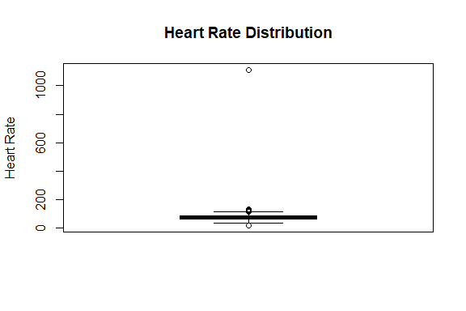<!-- -->

``` r
# Histogram for Systolic Blood Pressure
hist(HeartRiskData$Systolic_blood_pressure, 
     main = "Distribution of Systolic Blood Pressure", 
     xlab = "Systolic Blood Pressure", 
     col = "lightcoral", 
     border = "black")
```

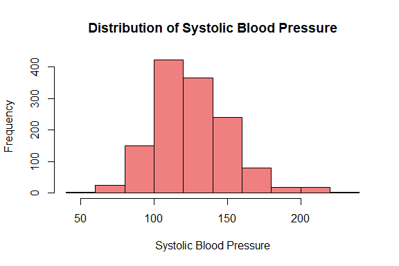<!-- -->

``` r
# Bar plot for Risk_Level
barplot(table(HeartRiskData$Risk_Level), 
        main = "Distribution of Risk Level", 
        xlab = "Risk Level", 
        ylab = "Frequency", 
        col = c("lightblue", "lightgreen", "lightcoral"))
```

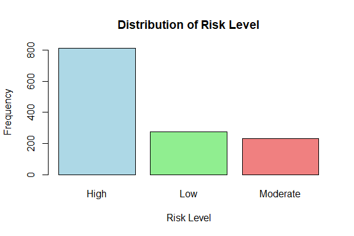<!-- -->

``` r
# Density plot for Blood_sugar
plot(density(HeartRiskData$Blood_sugar), 
     main = "Density Plot of Blood Sugar", 
     xlab = "Blood Sugar", 
     col = "purple")
```

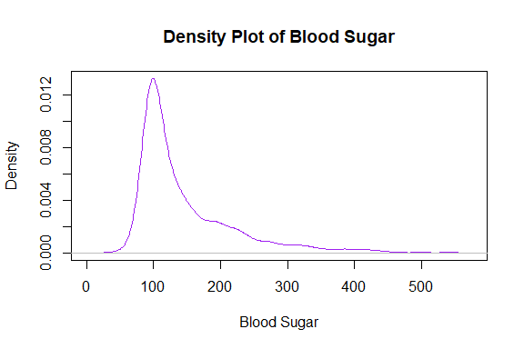<!-- -->

``` r
# Pairs plot for numeric variables
pairs(HeartRiskData[, c("Age", "Heart_rate", "Systolic_blood_pressure", 
                        "Diastolic_blood_pressure", "Blood_sugar", "CK_MB", "Troponin")], 
      main = "Pairs Plot for Numeric Variables", 
      pch = 19, col = HeartRiskData$Risk_Level)
```

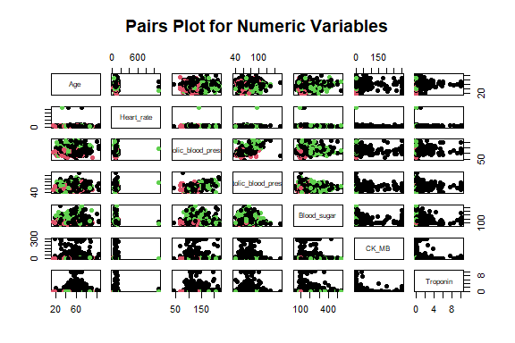<!-- -->

``` r
# Load necessary library for heatmap
library(corrplot)
```

    ## corrplot 0.95 loaded

``` r
# Calculate correlation matrix
cor_matrix <- cor(HeartRiskData[, c("Age", "Heart_rate", "Systolic_blood_pressure", 
                                    "Diastolic_blood_pressure", "Blood_sugar", "CK_MB", "Troponin")])

# Plot the correlation matrix
corrplot(cor_matrix, method = "circle", type = "upper", 
         tl.col = "black", tl.srt = 45, 
         main = "Correlation Matrix of Numeric Variables")
```

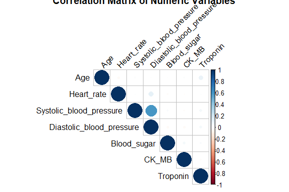<!-- -->

``` r
# Scatter plot for Age vs Heart_rate, colored by Risk_Level
plot(HeartRiskData$Age, HeartRiskData$Heart_rate, 
     main = "Scatter Plot of Age vs Heart Rate", 
     xlab = "Age", ylab = "Heart Rate", 
     col = HeartRiskData$Risk_Level, pch = 19)
legend("topright", legend = levels(HeartRiskData$Risk_Level), 
       col = 1:length(levels(HeartRiskData$Risk_Level)), 
       pch = 19)
```

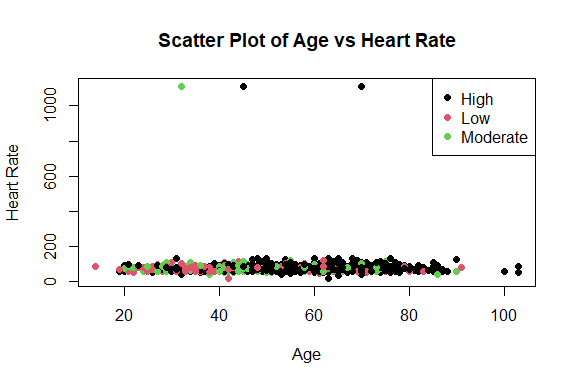<!-- -->

``` r
# Boxplot of Heart_rate by Risk_Level
boxplot(Heart_rate ~ Risk_Level, data = HeartRiskData, 
        main = "Heart Rate by Risk Level", 
        xlab = "Risk Level", ylab = "Heart Rate", 
        col = c("lightblue", "lightgreen", "lightcoral"))

# Violin plot for Systolic_blood_pressure by Risk_Level
library(ggplot2)
```

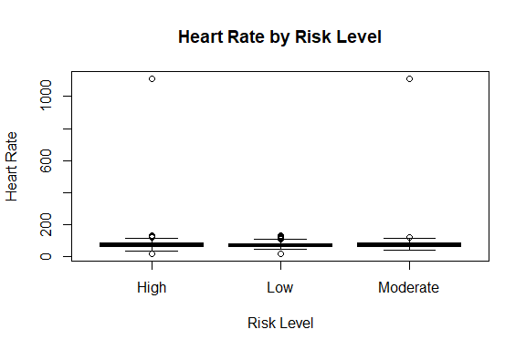<!-- -->

``` r
ggplot(HeartRiskData, aes(x = Risk_Level, y = Systolic_blood_pressure, fill = Risk_Level)) +
  geom_violin(trim = FALSE) +
  labs(title = "Violin Plot of Systolic Blood Pressure by Risk Level",
       x = "Risk Level", y = "Systolic Blood Pressure") +
  theme_minimal()
```

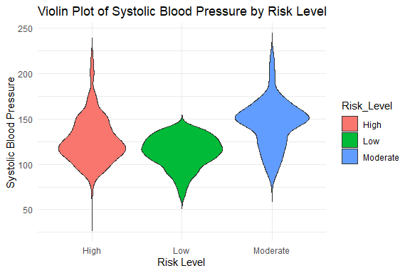<!-- -->
